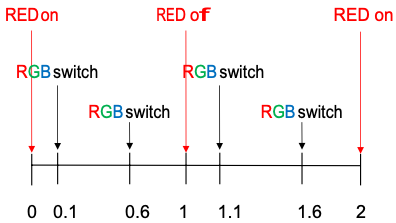

# Real Time Systems Course

The following repository contains C labs for my real time systems university course in 2021. 

## Description 

All labs except `lab2.c` are meant to run on a MSP-EXP432P401R Launchpad from Texas Instruments. Lab codes involve handling I/O events and flashing the LEDs on the MSP board. 

### Lab 2: C programming

Create a function that generates a copy of a linked list. 

### Lab 4: Basic I/O

When Button 1 is pressed, the selected LED changes (RED or RGB LED). When Button 2 is pressed, the current LED changes states. RED LED has 2 states, on and off. RGB LED has 8 states, corresponding to 7 different colours and off. 

### Lab 5: I/O using Interrupts

Add the functionality from `Lab 4` using interrupt service routines (ISR), with and without debouncing.

### Lab 6: Timers

Button 1 toggles between LEDs. When the button is pressed, the currently selected LED retains its state, and we begin updating the other LED as described below in BEHAVIOR.
Button 2 pauses/resumes the system. When paused, if LEDs were off, they
should remain off. If LEDs were on (or in a certain color), they should remain on (or in a certain color). When system resumes, BEHAVIOR continues as if no pause had occurred.

**BEHAVIOR:** assuming system is not paused, the currently selected LED should switch to the next state every second. E.g., if the Red LED is currently selected, it toggles on and off every second. If the RGB LED is selected, it changes to the next color every second. This has to be implemented with Timer interrupts. When the system is paused, no Timer interrupt should occur.

### Lab 7: Timer Modes

One RED LED to blink (on/off) every second, and the RGB LED to blink (change states) every 0.5 seconds. The two LEDs should be out of phase by precisely 0.1 seconds (see diagram below). Use TimerA0 in UP mode (and corresponding interrupts) to trigger the RED LED and TimerA1 in UP/DOWN mode (and corresponding interrupts) to trigger the RGB LED. 

## Installation 

- **Prerequisites**: 
    - **REQUIRED**: MSP-EXP432P401R ([available online](https://www.mouser.ca/ProductDetail/Texas-Instruments/MSP-EXP432P401R?qs=ttv6c7Py7lQcwH5KHMfcHA%3D%3D))
    - Install the latest version of:
        - [KEIL uVision MDK-Arm](https://www2.keil.com/mdk5/install/), an IDE for Cortex and Arm devices
        - [TExaS](http://edx-org-utaustinx.s3.amazonaws.com/UT601x/RTOSdownload.html),a suite of drivers and sample programs used to test hardware
        - [Windows drivers for the MSP432 LaunchPad board](https://www.ti.com/licreg/docs/swlicexportcontrol.tsp?form_type=2&prod_no=ti_emupack_setup_6.0.407.3_win_32.exe&ref_url=http://software-dl.ti.com/dsps/dsps_public_sw/sdo_ccstudio/emulation)

- Create a new KEIL project configured for the MSP board with the code for the specfied lab. Ensure your MSP board is plugged into your computer, then run the code.
